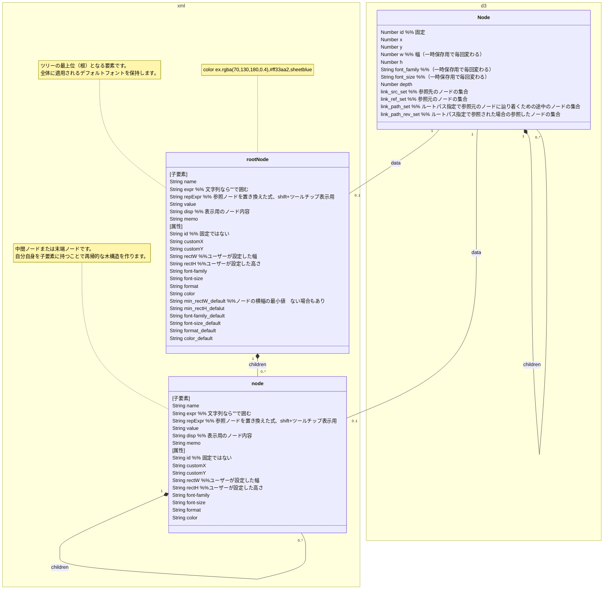

# leafree ドキュメント

## データ操作

### 共通処理

##### clear_ref( node )

指定されたノードの計算結果をクリアする。

### ノードの削除

##### delete_node( node )

ルートノードは削除できません。

子孫ノードも一緒に削除されますので、子孫ノードがあるときは、キャンセルするかの確認があります。

###### 呼び出し元

ノードの右クリックメニュー

##### deleteNode(node)  leafX_tree

###### 呼び出し元

delete_node

## データ構造

### ノード

### 親子関係・兄弟関係

### ルートノード

### ノード名

#### ノード名制限

`"`,`'`,`/`,`*`,`.`,` `（半角空白）~~,全角の数字~~は、ノード名には使えません。

~~※全角の数字は、将来のXML利用に備えて使えないことにした。~~

~~ノード名は、数字（半角・全角）、XML（大文字・小文字）で始まってはいけない。~~

##### isValidNodeName( name )

###### 呼び出し元

起動時

ロード時

ノード名変更時 renameNodeName,rename_reexpr_Node

TODO 子ノード挿入時

##### isValidNodeNameChar(ch)

#### 無名ノード名判定

ノード名の最初の文字が`_`である無名ノード名の判定

##### isNonameNodeName(name)

  true 無名ノード名

  false 無名ノード名でない

#### 兄弟ノード重複制限

兄弟ノードでは同じノード名は使えません（無名ノードを除く）。

親子間などでは同じノード名を使うことができます。

兄弟ノードでも、ノード名の最初の文字が`_`である無名ノードだけは、同一のノード名が使用できます。

##### checkDuplicateNodeName(parent, name)

parentノードの子ノードに、nameと重複するノード名があるか否か

###### 戻り値

 true 重複なし、または、無名ノード名

 false 重複

###### 呼び出し元

ノードドラッグ時 d3.drag()   renameDuplicateNodeName

ノード名変更時 renameNodeName,rename_reexpr_Node

子ノード挿入時 addChildNode,addChildToRootAtPosition

子ノードペースト時 paste_node	renameDuplicateNodeName

##### renameDuplicateNodeName(parent, name)

parentノードの子ノードと重複しないノード名をnameから作り出す

単に、ノード名の後ろを`_2`などにするだけ。

###### 戻り値

重複しないノード名

###### 呼び出し元

ノードドラッグ時 d3.drag()

子ノードペースト時 paste_node

##### checkNodeName(root) 

###### 利用関数

checkNodeNameBrother(nodeParent)

###### 呼び出し元

起動時

ロード時

### ノード内容

#### 計算式

先頭に、`=`を付けます。

例えば、`=12+3*2 - 8/4`と入力すると、ノードには`16`が表示されます。

`='価格' / '面積'`と入力し、価格という名前のノードの値が`1,200,000`、面積という名前のノードの値が`1,000`なら、ノードには、`1,200`が表示されます。

##### 文字列の処理

`="abc"`,`"abc"` value:'abc disp:abc   "abc"とはしない

`='abc`,`'abc` value:'abc disp:abc

getNodeValue で、`'abc`ならば、計算式用には`"abc"`として処理する。

#### 関数

#### ノード指定

計算式の中で、他のノードを指定すると、そのセルの値を使って計算します。

ノードの指定方法には、[ノード名直接指定](# ノード名直接指定)と[ノードパス指定](# ノードパス指定)があります。

※ノードの追加、削除、ノード名の変更により、指定先のノードが変わることがあります。

##### ノード名直接指定

ノード名をシングルクォーテーション（`'`）で囲むことにより、指定します。

同じノード名がある場合は、下記の探索順序で参照先のノードを特定します。

複数のノードが（同じ探索タイミングで）見つかった場合は、配列として処理します~~エラーになります~~。

例えば、`=sum('孫')`の場合に、孫というノード名のノードが３個あり、それぞれのノードの内容が、2,3,7だった場合は、`=sum([2,3,7])`と扱い、最終的には`12`になります。

`='孫'+3`の場合は、`[5, 6, 10]`となります。

###### 探索順序

１．まずは、子孫ノードの探索を行います。

　１－１．最初に、子ノードから探します。

　１－２．子ノードになければ、孫ノードから探します。

　１－３．孫ノードになければ孫ノードの子ノード、さらに子ノードと順番に探します。

２．子孫ノードになければ、祖先ノードの探索を行います。

　２－１．親ノードから探します（親ノードは1つなので、ノード名が一致するか）。

　　２－１－１．親ノードになければ、親ノードのの子ノード（兄弟ノードになります）から探します。

　　２－１－２．親ノードの子ノードになければ、親ノードの孫ノード、さらに子ノード、…と順番に探します。

　２－２．親ノード・親ノードの子孫ノードになければ、親ノードの親ノードから探します。

　　２－２－１．親ノードの親ノードになければ、親ノードの親ノードの子ノード、さらに孫ノード、…と順番に探します。

　２－３．親ノードの親ノード・親ノードの親ノードの子孫ノードになければ、親ノードの親ノードの親ノードから探します。

　　２－３－１．親ノードの親ノードの親ノードになければ、親ノードの親ノードの親ノードの子ノード、さらに孫ノード、…と順番に探します。

　２－４．同じように、さらに親ノード、その子孫ノードの順番に探します。

##### ノードパス指定

## ファイル

